# Trachoma Fitting and Near-Term Projections (Historical Simulations)
## Instructions for running in the Cloud using Docker

## Table of Contents
- [Things to Note](#things-to-note)
- [Setup](#setup)
- [Pipeline Overview](#pipeline-overview)
  - [File Name Pattern Key](#file-name-pattern-key)
  - [Pipeline Stages](#pipeline-stages)
    - [1. Fitting Preparation](#1-fitting-preparation---stage-fitting-prep)
    - [2. Fitting](#2-fitting---stage-fitting)
    - [3. Projections Preparation](#3-projections-preparation---stage-projections-prep)
    - [4. Near-term Projections](#4-near-term-projections---stage-nearterm-projections)
- [Usage](#usage)
  - [Docker Container Wrapper](#docker-container-wrapper)
    - [Basic Usage](#basic-usage)
    - [Artefact Handling](#artefact-handling)
  - [Direct Pipeline Usage](#direct-pipeline-usage)
  - [Advanced Docker Usage](#advanced-docker-usage)
- [Development and Testing](#development-and-testing)
  - [Speeding up the pipeline](#speeding-up-the-pipeline)
  - [Failed Batch Handling](#failed-batch-handling)
- [Notes](#notes)

## Things to Note
- Past version of projections was missing any MDA from 2022, and fits are missing many surveillance surveys. The latest version of these scripts (in `trachoma-amis-integration`) should be the correct version but they haven't been run
- The last runs in Feb 2025 were done on the cloud (<https://github.com/NTD-Modelling-Consortium/trachoma-docker-temp>) 
- May want to consider running with `amis-sigma=0.025` where there are IUs with `ESS < ess-threshold (default=200)` or batches that failed (we have done this for other diseases) using `bash run_container.sh --id=<failed_id> --folder-id="source-data-<yyyymmdd>" --amis-sigma=0.025 [--stop_importation]`.
- Keep note of which IUs had `ESS < ess-threshold (default=200)` so that they can be excluded from the future projections (scenarios to 2040 run by Igor)

### Setup
- Clone this repo - [trachoma-amis-integration](https://github.com/NTD-Modelling-Consortium/trachoma-amis-integration).
- At the root of the repo, build the Docker image:
  ```shell
  DOCKER_BUILDKIT=1 docker build --ssh default=$SSH_AUTH_SOCK . -t trachoma-amis-pipeline
  ```
  This assumes that you have added the SSH keys on your system to your Github account.

## Pipeline Overview

The Trachoma AMIS pipeline consists of four sequential stages:

```mermaid
graph TD
    subgraph "External Inputs"
        A["📁 ESPEN_IU_2021.tar.gz<br/>📁 Maps.tar.gz<br/>📁 fitting-prep-artefacts.tar.gz<br/>(Downloaded during Docker build)"]
    end
    
    subgraph "Stage 1: fitting-prep"
        D["prepare_histories_and_maps.R<br/>Input: --id={batch_id}"]
        D --> E1["📄 Maps/table_iu_idx_trachoma.csv"]
        D --> E2["📄 Maps/trachoma_maps.rds"]
        D --> E3["📄 Maps/trachoma_data.Rdata"]
        D --> E4["📄 endgame_inputs/IUs_MTP_{id}.csv"]
        D --> E5["📄 endgame_inputs/InputMDA_MTP_{id}.csv"]
    end
    
    subgraph "Stage 2: fitting"
        F["trachoma_fitting.R<br/>Input: --id={batch_id}"]
        F --> G1["📄 trajectories/trajectories_{id}.Rdata"]
        F --> G2["📄 infections/infections{id}.Rdata"]
        F --> G3["📄 AMIS_output/amis_output{id}.Rdata"]
        F --> G4["📄 ESS_NOT_REACHED.txt"]
        F --> G5["📄 summary.csv"]
    end
    
    subgraph "Stage 3: projections-prep"
        I["prepare_histories_projections.R<br/>Input: --id={batch_id}"]
        J["preprocess_for_projections.R<br/>Input: --id OR --failed-ids"]
        K["realocate_InputPars_MTP.R<br/>Input: --folder-id={folder_id}"]
        I --> L1["📄 mda_history_trachoma.csv"]
        I --> L2["📄 endgame_inputs/InputMDA_MTP_projections_{iu}.csv"]
        J --> M1["📄 InputPars_MTP_{id}.rds"]
        J --> M2["📄 InputPars_MTP_{iu}.csv"]
        K --> N["📄 projections/trachoma/{folder_id}/<br/>{country}/{country}{iu}/<br/>InputBet_{country}{iu}.csv"]
    end
    
    subgraph "Stage 4: nearterm-projections"
        O["RunProjectionsTo2026.py<br/>Input: --id={batch_id}<br/>--folder-id={folder_id}"]
        O --> P["📄 Trachoma_{country}{iu}.p"]
        O --> Q["📄 PrevDataset_Trachoma_{country}{iu}.csv"]
    end
    
    A --> D
    E1 --> F
    E2 --> F
    E3 --> F
    E4 --> F
    E5 --> F
    G1 --> I
    G2 --> I
    G3 --> J
    E1 --> J
    L1 --> K
    L2 --> K
    M1 --> K
    M2 --> K
    N --> O
    E1 --> O
    
    style A fill:#f9f9f9
    style D fill:#e1f5fe
    style F fill:#fff3e0
    style I fill:#f3e5f5
    style J fill:#f3e5f5
    style K fill:#f3e5f5
    style O fill:#e8f5e8
```



### File Name Pattern Key:
- `{id}` - Batch/task ID (e.g., 1, 2, 3...)
- `{iu}` - IU identifier (5-digit padded, e.g., 00001)
- `{country}` - Country code (e.g., ETH, KEN)
- `{country}{iu}` - Combined IU code (e.g., ETH00001)
- `{folder_id}` - Date-based folder (e.g., source-data-20250220)

### Pipeline Stages

#### 1. **Fitting Preparation** (`--stage=fitting-prep`)
**Script:** `prepare_histories_and_maps.R` - produces maps and histories from 1996-2021.

**Required Arguments:** `--id`

**Output Location:** `fitting-prep/artefacts/`

**Generated Files:**
- **Maps directory:**
  - `trachoma_espen_data.Rdata` - Processed ESPEN trachoma data
  - `trachoma_data.Rdata` - Aggregated trachoma data by IU/year
  - `iu_task_lookup.Rdata` - IU to TaskID lookup table
  - `trachoma_map_years.rds` - Years with survey data
  - `trachoma_maps.rds` - Processed trachoma maps with likelihood functions
  - `table_iu_idx_trachoma.csv` - IU/TaskID/country lookup table
- **Endgame inputs directory:**
  - `IUs_MTP_{id}.csv` - IU lists per batch
  - `InputMDA_MTP_{id}.csv` - MDA coverage data per batch

#### 2. **Fitting** (`--stage=fitting`)
**Script:** `trachoma_fitting.R` - runs AMIS fitting algorithm for each batch.

**Required Arguments:** `--id`  
**Optional Arguments:** `--amis-sigma`, `--amis-n-samples`, `--amis-target-ess`, `--num-cores`

**Output Location:** `fitting/artefacts/`

**Generated Files:**
- `trajectories/trajectories_{id}.Rdata` - Simulated trajectories per batch
- `infections/infections{id}.Rdata` - Simulated infections per batch
- `AMIS_output/amis_output{id}.Rdata` - AMIS algorithm results per batch
- `ESS_NOT_REACHED.txt` - Log of batches where ESS target wasn't reached
- `summary.csv` - Summary statistics for all batch runs

#### 3. **Projections Preparation** (`--stage=projections-prep`)
**Scripts:**
- `prepare_histories_projections.R`: produces the histories from 1996-2025.
- `preprocess_for_projections.R`: creates the `amis-n-samples (default=200)` parameter vectors (simulated from the fitted models) used in projections.
- `realocate_InputPars_MTP.R`: reorganizes the files with the `amis-n-samples (default=200)` samples used in projections, so that they are organized in the expected file hierarchy in the cloud.

**Required Arguments:** `(--id OR --failed-ids) AND --folder-id`  
**Optional Arguments:** `--species`, `--ess-threshold`

**Output Location:** `projections-prep/artefacts/`

**Generated Files:**
- `mda_history_trachoma.csv` - MDA history data
- `trachoma/data/coverage/endgame_inputs/IUs_MTP_{id}.csv` - IU lists per batch
- `trachoma/data/coverage/endgame_inputs/InputMDA_MTP_projections_{iu}.csv` - MDA coverage per IU
- `post_AMIS_analysis/InputPars_MTP_trachoma/InputPars_MTP_{iu}.csv` - Parameters per IU
- `post_AMIS_analysis/InputPars_MTP_trachoma/InputPars_MTP_{id}.rds` - Parameters per batch
- `post_AMIS_analysis/InputPars_MTP_trachoma/InputPars_MTP_allIUs.rds` - All IU parameters
- `projections/trachoma/{folder_id}/{country}/{country}{iu}/InputBet_{country}{iu}.csv` - Expanded parameters per IU

#### 4. **Near-term Projections** (`--stage=nearterm-projections`)
**Script:** `RunProjectionsTo2026.py` - runs the near-term projections for each IU, optionally with stopping importation after last survey year.

**Required Arguments:** `--id`, `--folder-id`  
**Optional Arguments:** `--num-cores`, `--stop-importation`

**Output Location:** `projections/artefacts/trachoma/{folder_id}/{country}/{country}{iu}/`

**Generated Files:**
- `Trachoma_{country}{iu}.p` - Simulation results (pickle format)
- `PrevDataset_Trachoma_{country}{iu}.csv` - Prevalence datasets (NTDMC format)

## Usage

### Docker Container Wrapper

The `run_container.sh` script provides a wrapper around Docker that handles artefact mounting automatically:

**Key Features:**
- **`fitting-prep` artefacts**: Uses container's built-in artefacts unless host directory is non-empty
- **Automatic directory mounting**: Mounts all artefact directories for seamless data exchange
- **Stage-aware argument validation**: Each stage validates its own required arguments

#### Basic Usage

```shell
# Run full pipeline
./run_container.sh --id=1 --folder-id=source-data-20250220

# Run individual stages
./run_container.sh --stage=fitting-prep --id=1
./run_container.sh --stage=fitting --id=1
./run_container.sh --stage=projections-prep --id=1 --folder-id=source-data-20250220
./run_container.sh --stage=nearterm-projections --id=1 --folder-id=source-data-20250220

# Skip fitting-prep (use existing pre-generated artefacts)
./run_container.sh --stage=skip-fitting-prep --id=1 --folder-id=source-data-20250220
```

#### Artefact Handling

The wrapper handles synchronization of the `fitting-prep` artefacts when building the image:

- **Container has pre-generated artefacts**: Downloaded during Docker build from `fitting-prep-artefacts.tar.gz`
- **Host directory empty**: Uses container's built-in artefacts (preserves pre-built data)
- **Host directory non-empty**: Uses host artefacts (overrides container's data)

This allows running later stages without re-running `fitting-prep`:
```shell
# Uses container's built-in fitting-prep artefacts
./run_container.sh --stage=nearterm-projections --id=1 --folder-id=source-data-20250220
```

### Direct Pipeline Usage

For more control or when not using the Docker wrapper, you can run the pipeline directly:

```shell
python run_pipeline.py --help
```

**Stage-Specific Examples:**
```shell
# Individual stages with minimum required arguments
python run_pipeline.py --stage=fitting-prep --id=1
python run_pipeline.py --stage=fitting --id=1 
python run_pipeline.py --stage=projections-prep --id=1 --folder-id=source-data-20250220
python run_pipeline.py --stage=nearterm-projections --id=1 --folder-id=source-data-20250220

# With optional parameters
python run_pipeline.py --stage=fitting --id=1 --amis-sigma=0.003
# Skip failed IDs when processing all batches
python run_pipeline.py --stage=projections-prep --failed-ids=1,2,3 --folder-id=source-data-20250220
```

### Advanced Docker Usage

For complex scenarios requiring custom volume mounts, use `docker run` directly:

```shell
# Mount external artefacts
docker run --rm \
  -v /path/to/external/fitting-prep:/ntdmc/trachoma-amis-integration/fitting-prep/artefacts \
  -v ./projections-prep/artefacts:/ntdmc/trachoma-amis-integration/projections-prep/artefacts \
  -v ./projections/artefacts:/ntdmc/trachoma-amis-integration/projections/artefacts \
  trachoma-amis-pipeline:latest \
  --stage=nearterm-projections --id=1 --folder-id=source-data-20250220
```

## Development and Testing

### Speeding up the pipeline

Use reduced AMIS parameters for faster testing:

```shell
./run_container.sh \
  --id=1 \
  --folder-id=source-data-20250220 \
  --amis-sigma=0.025 \
  --amis-n-samples=10 \
  --amis-target-ess=1 \
  --ess-threshold=1
```

### Failed Batch Handling

For batches that failed to reach ESS threshold:
```shell
# Rerun with relaxed sigma parameter
./run_container.sh --id=11 --folder-id=source-data-20250220 --amis-sigma=0.025

# Process all IDs except the failed ones in projections-prep
./run_container.sh --stage=projections-prep --failed-ids=1,2,3 --folder-id=source-data-20250220
```

## Notes

- `folder-id` Convention: Uses format `source-data-<yyyymmdd>` to organize outputs by date
- **Environment Variables**: Scripts can use `SLURM_ARRAY_TASK_ID` if `--id` is not provided
- **File Validation**: Near-term projections validates required input files exist before proceeding
- **Error Handling**: Each stage validates its arguments and provides clear error messages for missing requirements

**NOTE**: The histories (for both fitting and projections) generated in the `fitting-prep` and `projections-prep` stages, are saved inside the Docker container at `fitting-prep/artefacts/trachoma/data/coverage/endgame_inputs` and `projections-prep/artefacts/trachoma/data/coverage/endgame_inputs` respectively.